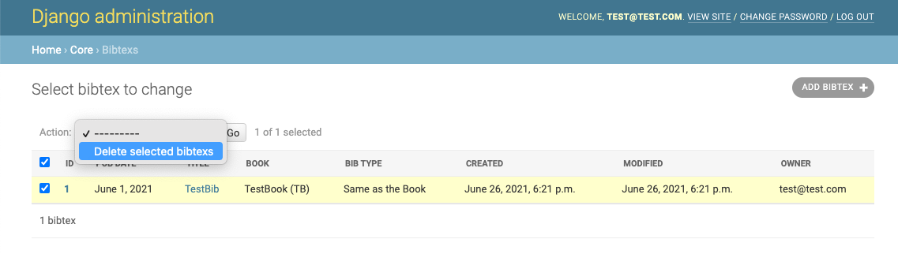

# Guide for Admins

このページでは，管理者向けの操作に関して説明します．

## 管理者アカウントの作成

Djangoの管理者ページ (e.g., [http://localhost:7000/admin/](http://localhost:7000/admin/)) より作成できます．
まず「ADD USER」からユーザを作成し，詳細設定のページで `Superuser status` と `Staff status` のPermissionを付与します．

!!! Warning "テストユーザ"
    サイトを外部公開する際は，必ずのテストユーザは削除してください・

## エントリの削除方法

間違ってデータを削除することを防ぐために，エントリ (Bibtex, Books, Authors, etc) の削除は管理者のみが実行できます．一般ユーザが間違えてエントリを作成してしまった場合は，ユーザからの連絡を受け，管理者が削除を行ってください．

削除をする場合は，Djangoの管理者ページ (e.g., [http://localhost:7000/admin/](http://localhost:7000/admin/)) にアクセスし，該当のエントリを探し，削除の処理を行います．

